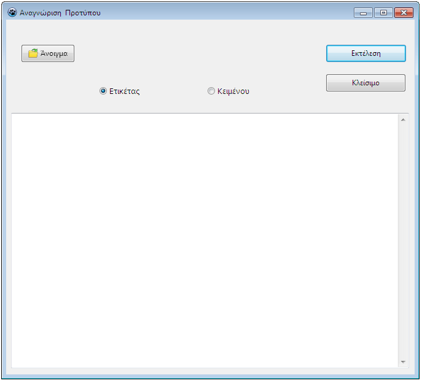
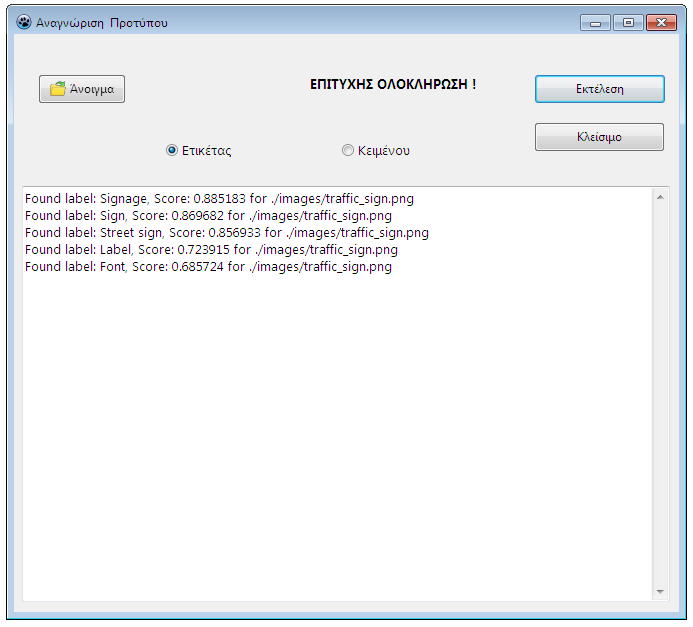
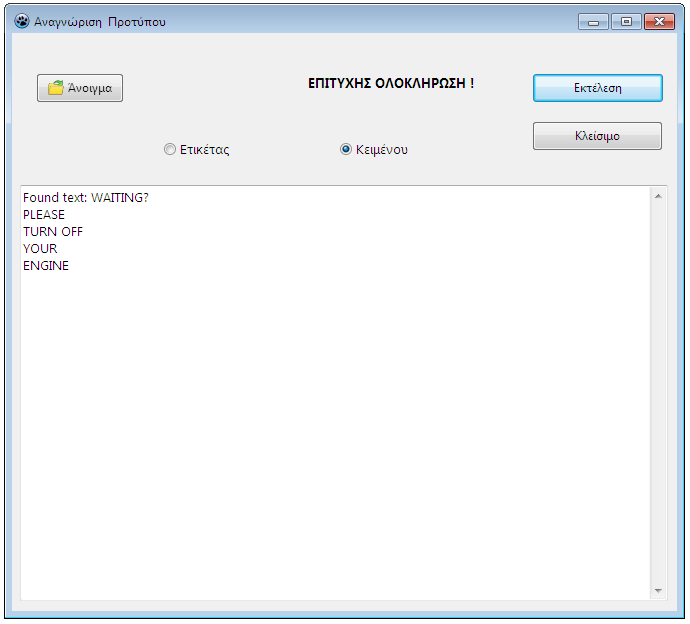

											 GUI OCR app

A GUI (graphical user interface) OCR (optical character recognition) app where the user is able to choose any image file *(.jpg,.png,.bmp,.etc)*  and get either label (entity) or textual information from it via Google Vision API. A [Google cloud](https://cloud.google.com/) account should be created beforehand and the appropriate Google Vision API credentials need to be stored in a .json file (key folder) along with the proper environmental variable (GOOGLE_APPLICATION_CREDENTIALS).

This app has been made via [Golang](https://golang.org/), [Lazarus 2.x](https://www.lazarus-ide.org/) and [Google Vision API](https://cloud.google.com/vision).

**General view**

**Process view**

**Success view**

